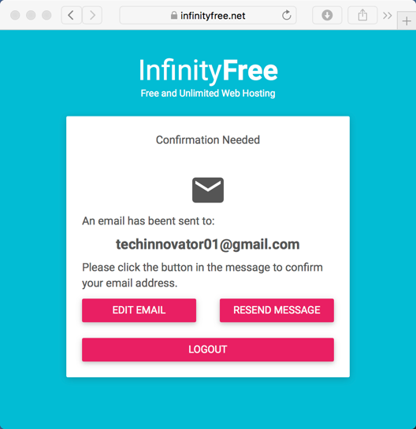
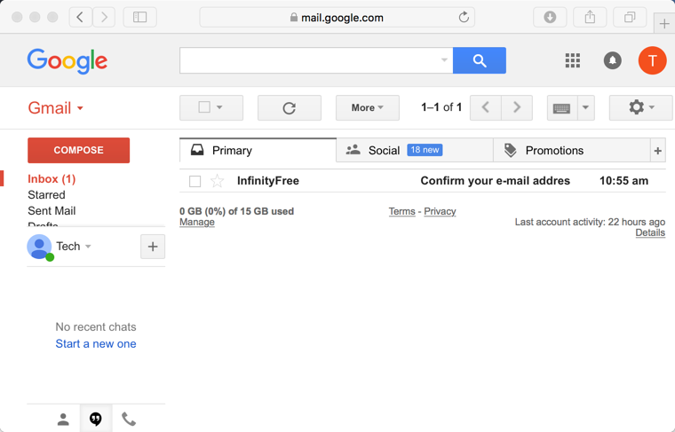
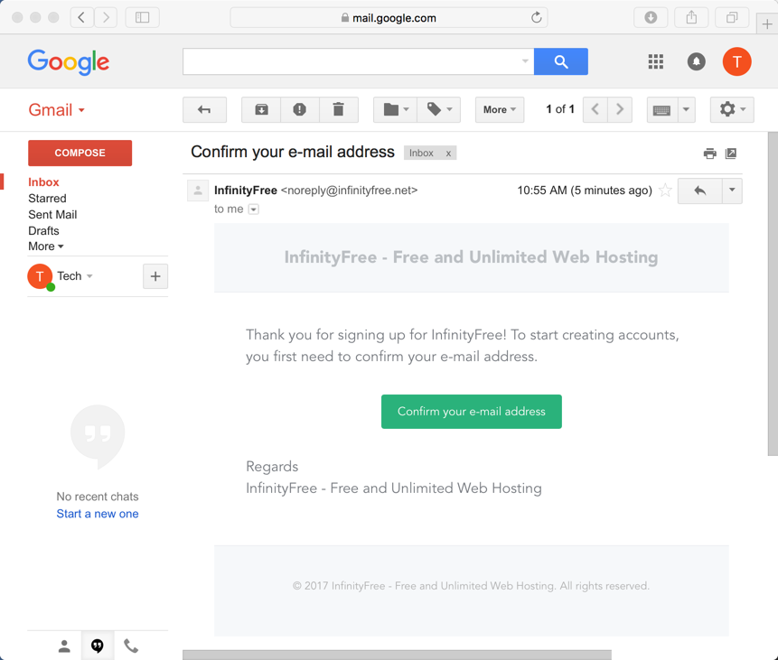
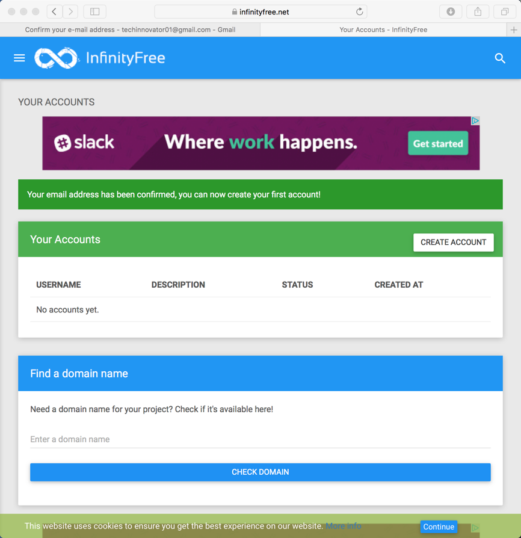
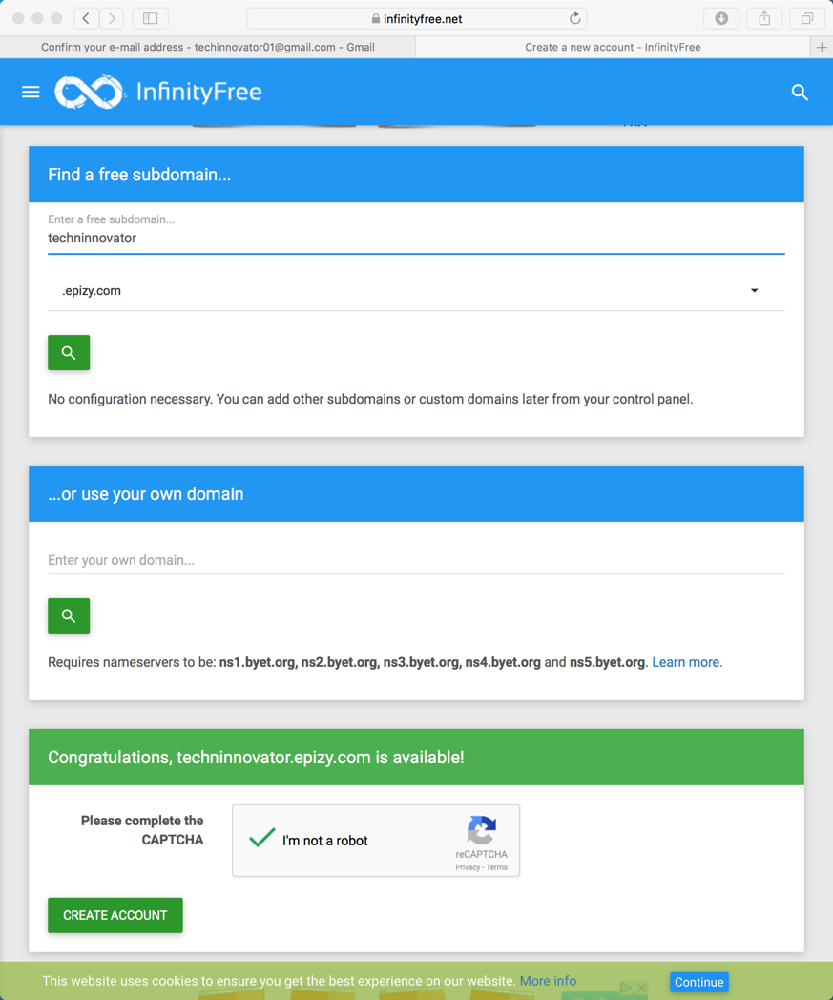
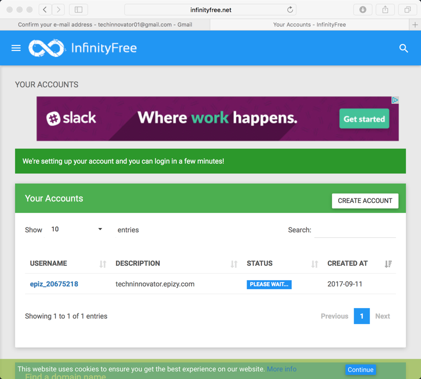
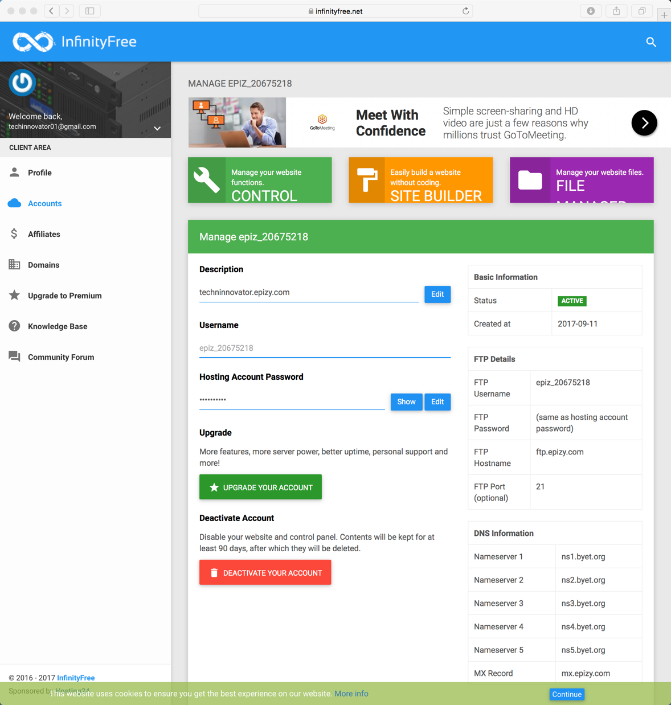
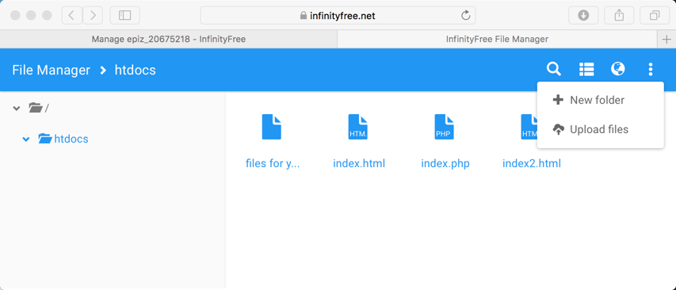
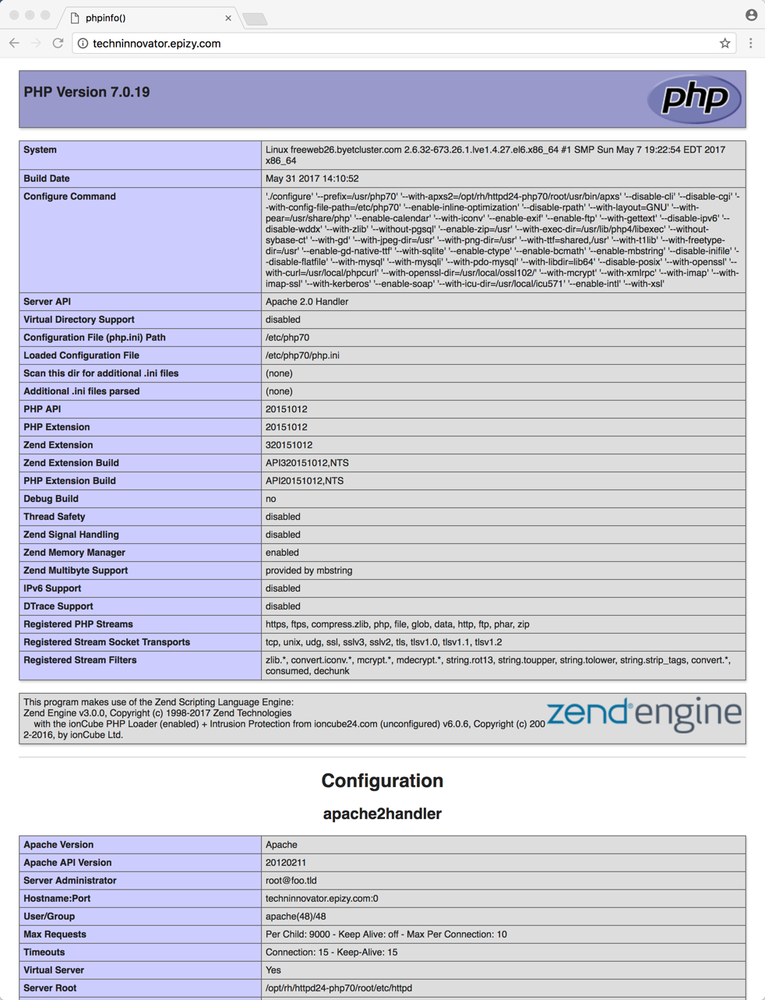
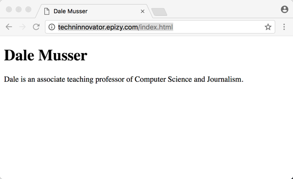

### Web and Database Hosting Using InfinityFree

This document covers setting up web hosting.

#### Create InfinityFree Account

Go to [InfinityFree](https://infinityfree.net)

Click on [Sign up Now](https://infinityfree.net/register)

Fill in the form to sign up for a free account.


After signing up you will need to confirm your email address.



Go to your email client and find the email from InfinityFree.



Open the email from InfinityFree and click on the **Confirm your e-mail address** button.



Once you confirm your email address you should have access to InfinityFree.



An account in **Your Accounts** on the InfinityFree web site represents hosting for one web site.  This hosting includes the hosting for web content as well as one or more databases.

The next step is to create an account.  Click on the **CREATE ACCOUNT** button on the **Your Accounts** page.

Each hosted web site needs a domain name.  InfinityFree provides a domain name at no cost that is a subdomain of epizy.com, freecluster.eu, and rf.gd.

In the **Find a free subdomain...** box, select epizy.com, freecluster.eu, or rf.gd and then enter a name in the **Enter a free subdomain...** field.  The subdomain has to be one that is not already in use by someone else.  Click on the magnifying lens in the **Find a free subdomain...** box.  If the subdomain is available, a box is displayed at the bottom of the page that indicates it is available and presents a button to create an account using it.  Create the account.



After clicking to create an account, a page is displayed that shows the new account in the list of accounts and indicates it is being created (under **STATUS** is displays **PLEASE WAIT...** to indicate setup of hosting is in progress).



You may need to refresh the browser to see changes to the status.  You need to wait until the status is **ACTIVE** before you can begin using the hosting.  To manage the hosting, click on the account username under the **USERNAME** column in **Your Accounts**.



The **Hosting Account Password** (which is made visible by clicking the **Show** button) is the same password you will use for access to databases and for transferring files using FTP.

The green button with the wrench that says **Manage your website function. CONTROL** on it is used to create and manage databases and configure the web hosting.

The purple button with the file folder that says **Manage your web site files. FILE MANAGER** on it is used to manage files hosted by the web server.  Note that web accessible files need to be in the **htdocs** folder.

The orange button with a paint roller that says **Easily build a web site without coding. SITE BUILDER** on it will not be used with the course.

The web address for your web site is displayed under **Description**.  If you enter the web address into a web browser a default web page placed by the host is displayed.


#### Test Web Hosting

Create two files that are to be uploaded to the **htdocs** folder using the **FILE MANAGER** or using an FTP client.  The files must be create with a **plain text editor**.  Do not use Word or an editor that is used for creating formatted documents.  ([Atom](https://atom.io) is one possible choice for text editors.)

The two files that are to be created are index.php and index.html.

In the index.php file put the following:

```php
<?
phpinfo();
?>
```

In the index.html file put the following where "Put your name here" is to be replaced with your name and "Say something about yourself here." is to be replaced with information about yourself.

```html
<!DOCTYPE html>
<html>
<head>
<title>Put your name here</title>
</head>
<body>
<h1>Put your name here</h1>
<p>Say something about yourself here.</p>
</body>
</html>
```

To upload the files, click on the purple button with the file folder that says **Manage your web site files. FILE MANAGER** on it.  Go the htdocs folder before selecting the three vertical dot icon and selecting **Upload files**.



Once the files (index.php and index.html) are uploaded to the htdocs folder on the web host, test that they are accessible.

The URL (web address) to access index.php is at your domain name or at your domain name with /index.php appended to the end of the domain.  My domain is techninnovator.epizy.com, so http://techninnovator.epizy.com or http://techninnovator.epizy.com/index.php can be used to access the index.php file.  The .htaccess file in the root directory of your account's file storage has the following line in it.  This line tells the web server what files to automatically look for if no file path is specified in the URL.  First it looks for an index.php and if it finds it, it loads it.  If not, it goes to the next entry in the list.

```
DirectoryIndex index.php index.html index2.html
```

For a php script, the web server runs the program and then returns the output of the program to the browser.  phpinfo() is a php function that displays information about the php setup on the server as a formatted web page.  The following is what is displayed when I access index.php on my server.



The URL to access index.html is at your domain name with /index.html appended to the end of the domain. My domain is techninnovator.epizy.com, so  http://techninnovator.epizy.com/index.html can be used to access the index.html file.  The following is what is displayed when I access index.html on my server.


